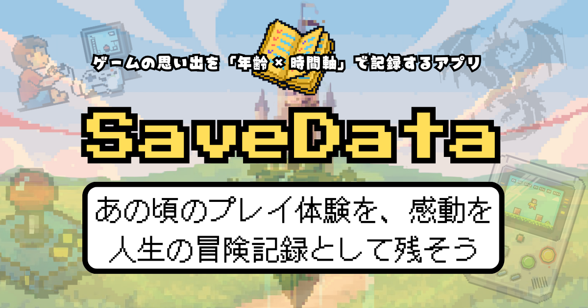
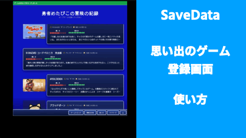
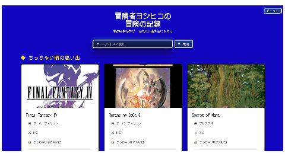

# SaveData

**SaveData** は、ゲームの思い出を **「年齢 × 時間軸」** で記録・共有できる、ノスタルジー特化型サービスです。

## URL

https://savedata.quest

## テストアカウント

- Email: test@test.com
- Password: password

## アプリ開発記録

[SaveData 開発記録（Notion）](https://www.notion.so/SaveData-2de905f284078065926eeb848b141247?source=copy_link)

---

## サービス概要

SaveData は、**いつ・何歳の頃に・どんなゲームを遊んでいたのか**を記録し、振り返ることができるサービスです。

ゲーム体験を単なるプレイ記録として残すのではなく、
**人生の年表の一部として保存し、再体験できること**を目指しています。

---

## このサービスを作った理由

子どもの頃に夢中で遊んだゲーム。
学生時代に友人と語り合ったタイトル。
大人になってから時間を作って遊んだ作品。

ゲームは、人生のさまざまなフェーズと深く結びついています。
しかし既存サービスの多くは、**「何を遊んだか」「どこまで進んだか」** に焦点を当てており、
**「いつ・どんな気持ちで遊んだか」** は記録されにくいと感じていました。

私は、ゲームを単なる娯楽や消費コンテンツではなく、
**人生の記憶として残せるものにしたい**と考えました。

同じゲームでも、年齢や環境が違えば受け取り方は変わります。
その違いを可視化することで、
**「自分だけの思い出」と「世代の共通体験」を同時に味わえるサービス** を作りたいと考え、開発に至りました。

---

## 補足

※ 本アプリは現在も制作中のため、UI / UX が README 内の画像と一部異なる場合があります。

---

## 使い方

### 1. アカウント作成

トップページから新規登録を行います。
プレイヤー名・生年月日などを入力して、アカウントを作成します。

### 2. ゲームを登録

「ゲーム登録」から、以下の情報を入力できます。

- ゲームタイトル
- プレイした年齢
- ハード / ジャンル
- 面白さ・難易度（５段階）
- 思い出メモ
- カバー画像（任意）

### 3. 年表で振り返る

登録したゲームは、**年齢順のタイムライン** として表示されます。
自分のゲーム体験を、人生の流れに沿って振り返ることができます。

### 4. 詳細の確認・編集

各ゲームカードをクリックすると、以下の操作が可能です。

- 思い出の詳細表示
- 編集
- 削除
- 思い出のシェア機能（Xに投稿）

---

## ターゲット層

### メインターゲット

- 30代の社会人
- 小学生〜高校時代に、スーパーファミコン / PlayStation / PSP / Nintendo DS などを経験してきた人
- 現在もゲームが好きだが、プレイ時間は限られている人
- レトロゲームや当時の思い出話に、強い懐かしさを感じる人

### この層をターゲットにした理由

この世代は、さまざまなハードやジャンルのゲームが発売された
**“ゲーム戦国時代”** を体験してきた世代です。

そのため、ゲーム体験の幅が広く、
さらに SNS や Web サービスへのリテラシーも比較的高いため、
本サービスとの親和性が高いと考えました。

また、**過去を振り返ること自体に価値を感じやすい世代**でもあり、
SaveData の体験価値を最も感じてもらいやすいと考えています。

---

## サービス利用イメージ

1. ユーザー登録
2. 生年を入力
3. 遊んだゲームを登録
4. 「何歳のときに遊んだか」「印象に残った感情」などを記録
5. 年齢軸の年表として可視化
6. 同じゲームを遊んだ他ユーザーの年齢分布を閲覧（開発中）

これにより、以下のような価値を提供します。

- 自分のゲーム人生から、人生そのものを俯瞰できる
- 「みんなもこの時期に遊んでいた」という共感を得られる
- 世代差による体験の違いを発見できる

---

## ユーザー獲得について

受動的な流入に頼るのではなく、
**「世代 × 共感 × 懐かしさ」** を軸に、能動的な拡散を狙っています。

### 想定している施策

- X（旧Twitter）での世代タグ投稿
  - 例：`#SFC世代` `#PS2世代` `#レトロゲーム思い出`
- ゲーム系コミュニティ（Discord・掲示板）での紹介
- 投稿した年表や比較画面を SNS でシェアできる導線づくり
- 「子どもの頃に流行ったこのゲーム」など、共感を誘うコピー設計
- YouTube Shorts / TikTok などのショート動画による使用イメージ発信

また、自身でも YouTube でゲームチャンネルを運営しているため、
その活動の中で自然に紹介できる導線も見込んでいます。

サービスを押し付けるのではなく、
**「懐かしい」「わかる」から自然に触ってもらえる拡散** を意識しています。

---

## 差別化ポイント・推しポイント

### 既存サービスとの比較

#### Backloggery / Gamery など

- ゲームの所有・進捗管理が主目的
- 何をどれだけ遊んだかは分かる
- ただし、体験の背景や感情までは残りにくい

### SaveData の特徴

- **年齢軸を中心とした年表 UI**
- **感情・思い出を主軸にした記録体験**
- **同一ゲームにおける年齢分布の可視化**（開発予定）

既存サービスが **「ゲームを管理する」** ことに重点を置いているのに対し、
SaveData は **「ゲームを人生の記憶として残す」** ことに特化している点が最大の差別化ポイントです。

---

## 機能実装関連

### MVPリリースまでの機能

- ユーザー登録 / ログイン
- 生年登録
- ゲーム登録機能（タイトル・プレイ時期・一言メモ）
- 年齢 × ゲーム年表表示

※ この時点では、他ユーザーとの共有機能はありません。
共有要素は本リリース以降で実装予定です。

### MVPリリース後のフィードバック

- [セルフレビュー](https://qiita.com/metappi/items/1f17a07ae38e3f53b620)
- [ユーザーレビュー](https://qiita.com/metappi/items/b363a91cdf00c97ee847)

### 現在の主な課題

設計関連

- ファットコントローラーになっているものの切り出し パッと見てわかる設計
- RSPEC等テストの実装
- DBアクセスの効率化（N+1問題回避のためgem導入など）

### 実装にあたり苦労した点

ユーザーのゲーム登録にかかる時間が長く、登録しづらいと言うフィードバックを
頂き、簡易入力のために「ゲームを検索し、データを取得するAPI」の実装に苦労しました。

そのAPIは海外サイトで運営している関係上、英語でのタイトルは対応しているが
日本語にはほとんど対応しておらず、また完全一致でないと
そもそも検索結果に出てこないなど使い勝手に問題がありました。

その中でもなるべくユーザーに英語タイトルで入力していただく工夫や
ヒットしやすいロジックを組むなどする設計を実装するのが特に大変でした。

結果としてタイトルのみならず、
画像、ゲームジャンル、ゲームハードも取得させ、
UIUX体験を大幅に向上できました。

実装は苦労しましたが、その分ユーザーからのご評価も頂けたのと
私自身の学びにも繋がったので実装してよかったです。

---

## 本リリースに向けて開発中の内容

- フィードバックをもとにした継続改善
- 年表の SNS シェア機能
- UI / UX のブラッシュアップ
  - どの環境でも表示崩れしにくい状態へ改善
- IGDB API を活用したゲーム / ハード発売年データの取り込み
- ゲーム登録時の入力簡略化

---

## 本リリース後に実装予定

SaveData では、
**「懐かしい。あの頃はこのゲームにこんな思い出があったなぁ」**
という感覚を、より深く、更にユーザー同士でも
共有し、思い出を共有できる方向へ拡張していきます。

- 感情タグの拡充
  - 例：楽しい / 怖い / 切ない
- コメント・リアクション機能
- ユーザーの年表上に「時代の出来事」を重ねて表示し、
  **ユーザー個人のゲーム体験 × ゲーム史** を同時に振り返れる体験の提供
- トピック投稿機能
  - （現時点で）人生最後にやりたいゲーム
  - 記憶を消してまたやりたいゲーム
  - 推しのコントローラーベスト3
- 年表をまとめた「ゲーム絵巻」を JPG / PDF で保存できる機能
- 年齢分布の集計クエリによるグラフ表示
- 主人公名のランダム生成機能
- AI を活用した、おすすめゲーム紹介機能
  - 商品リンクの実装も検討
- 各種スキンの実装（有料化も検討）
- ゲーム登録状況に応じて進行する RPG 要素の実装
  - 小窓で進行する形を想定
  - 自身の C++ / Python キャッチアップにもつなげたいと考えています

---

## 技術スタック

| 分類           | 技術                          |
| -------------- | ----------------------------- |
| バックエンド   | Ruby 3.2.2                    |
| フレームワーク | Ruby on Rails 7.2.3           |
| フロントエンド | TailwindCSS                   |
| データベース   | PostgreSQL（Neon）            |
| 認証           | Devise                        |
| 画像           | Cloudinary                    |
| メールの送受信 | Resend                        |
| インフラ       | Render                        |
| 開発環境       | Docker                        |
| 進捗管理       | GitHub Issue Project          |
| テスト実装     | CI/CD GitHubActionsにて自動化 |

設計手順
用件定義→技術選定→Figmaにて画面遷移図の作成
→E-R図でリレーション決める→
MVPリリース→フィードバックをもとに改善→本リリース
本リリース後もユーザーの意見、Googleアナリティクス等
用いて改善、レベルアップさせていきます。

## 技術選定理由

### フロントエンド技術選定理由

**TailwindCSS を採用**

- **迅速なUI開発**:簡単に細かい調整ができるため採用しました。
  全てのCSSコードやJSやHTMLを記述するとなると肝心のバック側にかける時間がなくなってしまい開発時間がかかりすぎるので
  今回はこちらを採用しました。
  "rails tailwindcss:watch"と組み合わせることでハンズオンですぐに結果を反映させつつ
  作成できたのでその点も良かったです。

カスタムアニメーション（`@keyframes`）やグラデーション表現を柔軟に組み込めるのでRPG風UIUXデザインを作る上で
の相性がいいと感じました。

- **一貫性のあるデザイン**: カスタムプロパティや定義済みクラスにより、プロジェクト全体でデザインの統一性を保ちやすい
- **学習コスト**: Rails開発との相性が良く、既存の知見を活かしつつ短期間でプロダクションレベルのUIを実装できる点

### バックエンド技術選定理由

**Ruby / Ruby on Rails を採用**

本サービスは CRUD 中心で、ユーザー・ゲーム・年表といったデータの関係性が明確です。
そのため、開発効率と保守性の観点から Ruby / Ruby on Rails を採用しました。
また、Railswayが個人的にとても理解しやすく、学習の中でも一番楽しみつつ
理解して取り組めた点で、いつかはRailsを用いた開発をしてみたいと思っていたため。

- **Convention over Configuration**: Rails の規約により、認証（Devise）、画像管理（Active Storage + Cloudinary）
  データベース操作（Active Record）などの実装が迅速かつ統一的に行える
- **豊富なGem資産**: メール送信（Resend）、OAuth認証（Google）、API連携（IGDB）など、必要な機能をGemで効率的に実装可能
- **保守性の高さ**: MVC アーキテクチャと Service Object パターンの採用により、ビジネスロジックを整理し、機能追加や変更に強い設計を実現
- **開発速度**: 個人開発かつ短期間でのMVPリリースを目指す本プロジェクトにおいて、Rails の生産性の高さは大きなアドバンテージ

### データベース選定理由

**PostgreSQL（Neon）を採用**

- **Render との親和性**: Render での PostgreSQL 運用実績が豊富で、デプロイ・運用が容易な点
- **Neon のサーバーレスアーキテクチャ**: 無料枠で本番運用が可能。従量課金制のため、初期コストを抑えながら開発できる点
- **Rails との相性**: Active Record が PostgreSQL の機能を十分にサポートしており、複雑なクエリやリレーション管理がスムーズな点

### 外部サービス選定理由

**デプロイ環境（Docker + Render）**

- **環境の一貫性**: Dockerfile.dev（開発環境）と Dockerfile（本番環境）を分離することで、ローカル・本番間の環境差異を最小化しました。
- **Render の選定理由**:
  - GitHub 連携による自動デプロイが容易
  - 無料枠でPostgreSQL + Webサーバー運用が可能
  - ログ管理やスケーリングの設定がシンプル

**認証基盤（Devise）**

- Rails のデファクトスタンダードで、OAuth（Google認証）との統合が容易
- パスワードリセット、メール確認などの認証フローが標準実装済み

**画像管理（Cloudinary）**

- CDN 経由での高速配信
- 画像の最適化・リサイズが自動化され、ユーザー体験向上に寄与
- Active Storage との統合がスムーズ

**メール送信（Resend）**

- 開発者フレンドリーなAPIで実装が容易
- 無料枠で十分な送信数を確保
- カスタムドメイン対応でブランド性を維持

**テスト自動化（GitHub Actions）**

- CI/CD パイプラインにより、Pull Request ごとに RSpec テストを自動実行
- コードの品質を保ちつつ、デプロイの安全性を確保

---

## その他リンク

- [X（旧Twitter）](https://x.com/zundabyon)
  日々の記録、技術アウトプットなど
- [note](https://note.com/metappi_hetappi)
  どのようにキャッチアップしてきたかの記録
- [Qiita](https://qiita.com/metappi)
  技術記事
- [アプリ開発記録（Notion）](https://www.notion.so/SaveData-2de905f284078065926eeb848b141247?source=copy_link)

- ご意見、ご感想などお待ちいたしております。
  [Eメール](savedata.quest02990@gmail.com)

---

## 最後に　開発背景

この SaveData は、私が**初めて設計からリリースまで行ったアプリ**です。

昔から私は、ゲームに育てられてきました。ゲームを通じて友達の輪が広がり
その中で論理的思考や、相手を思いやる気持ちなど、
多くのことを学んできました。

私にとってゲームは、人生の教科書のひとつです。

そしていつか、どのような形であれ
**ゲーム業界に対して GIVE をしたい** と考えていました。

ご縁があり、RUNTEQ というプログラミングスクールに出会い
Ruby と Rails を中心にフルスタックな開発手法を学んだ上で
今回その想いをアプリという形に落とし込みました。

このサービスが、

- 「またゲームをやってみようかな」
- 「お父さんは昔こんなゲームをやってたんだぞ」
- 「当時、ずっと好きだった子とゲームしてたなぁ、、、甘酸っぱい思い出。」

そんな会話や思い出のきっかけになれば、とても嬉しいです。

まだまだ発展途上のアプリではありますが、
愛情を込めて作っています。

ぜひ少しでも触っていただき、
お時間があれば X の DM などで
フィードバックをいただけると嬉しいです。

ここまでご覧いただき、ありがとうございました。
それでは、お楽しみください。

冒険の扉を開ける（アプリページに飛びます）
https://savedata.quest

テストアカウント

- Email: test@test.com
- Password: password
