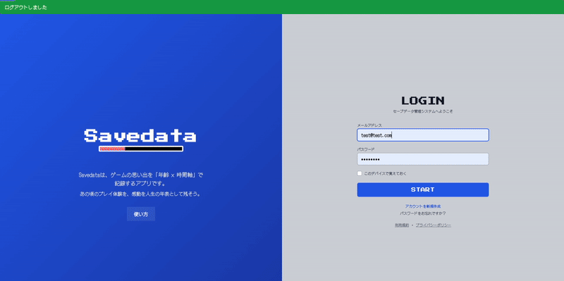

# アプリ名

SaveData

URL:
https://savedata-app.onrender.com/

テストアカウント:
Email: test@test.com
Password: password

[アプリ開発記録](https://www.notion.so/SaveData-2de905f284078065926eeb848b141247?source=copy_link)

## サービス概要

SaveData は**ゲームの思い出を「年齢 × 時間軸」で記録・共有できるノスタルジー型サービス**です。
いつ、何歳の頃に、どんなゲームを遊んでいたのかを振り返ることで、
**個人のゲーム体験を人生の年表として保存・再体験**できます。

## このサービスへの思い・作りたい理由

子どもの頃に夢中で遊んだゲーム、
学生時代に友人と語り合ったタイトル、
大人になってから時間を作って遊んだ作品――

ゲームは人生の各フェーズに深く結びついていますが、
多くの既存サービスは「何を遊んだか」「どこまで進んだか」
に焦点を当てており、
「いつ・どんな気持ちで遊んだか」は記録されにくい状況です。

私は、ゲームを単なる娯楽や消費コンテンツではなく、
人生の記憶として残せるものにしたいと考えました。

同じゲームでも、
年齢や環境が違えば受け取り方は変わります。
その違いを可視化し、
「自分だけの思い出」と「世代の共通体験」を
同時に味わえるサービスを作りたいと考え、
本サービスの開発に至りました。

---

※こちらのアプリは再作中の為、UIUXが
表示のものと若干異なる可能性がございます。

## 使い方

### 1. アカウント作成

トップページから新規登録を行います。
プレイヤー名・生年月日などを入力してアカウントを作成します。

### 2. ゲームを登録

「ゲーム登録」から以下の情報を入力できます。

- ゲームタイトル
- プレイした年齢
- ハード / ジャンル
- 面白さ・難易度（10段階）
- 思い出メモ
- カバー画像（任意）

### 3. 年表で振り返る

登録したゲームは、年齢順のタイムラインとして表示されます。
自分のゲーム体験を振り返ることができます。

### 4. 詳細の確認・編集

各ゲームカードをクリックすると、

- 思い出の詳細表示
- 編集
- 削除

を行うことができます。

---

## ターゲット層

### メインターゲット（ペルソナ）

- 30代の社会人
- 小学生〜高校時代にスーパーファミコン / PlayStation / PSP / Nintendo DSなどさまざまなハードを経験
- 現在もゲームが好きだが、プレイ時間は限られている
- レトロゲームや当時の思い出話に強い懐かしさを感じる

### ターゲット層の理由

この世代は、

- 様々なハード、ジャンルのゲームが発売されたいわば
  ゲーム戦国時代だからこそ様々なゲーム体験ができる環境にあった
- SNS や Web サービスへのリテラシーがある　抵抗がない
  と考えます。

過去を振り返る行為そのものに価値を感じやすい点から、
本サービスの体験価値と高い親和性があると考えました。

---

## サービス利用のイメージ

1. ユーザー登録
2. 生年を入力
3. 遊んだゲームを登録
4. 「何歳のときに遊んだか」「印象に残った感情」などを記録
5. 年齢軸の年表として可視化
6. 同じゲームを遊んだ他ユーザーの年齢分布を閲覧（開発中）

これにより、

- 自分のゲーム人生から人生そのものを俯瞰できる
- 「みんなもこの時期に遊んでいた」という共感を得られる
- 世代差による体験の違いを発見できる

といった体験価値を提供します。

---

## ユーザーの獲得について

- X（旧 Twitter）での世代タグ投稿
  - #SFC 世代 #PS2 世代 #レトロゲーム思い出 など
- ゲーム系コミュニティ（Discord・掲示板）での紹介
- 投稿された年表や比較画面を SNS でシェアできる設計
- 「子供の頃流行ったこのゲーム」など共感を誘うコピーによる拡散
- YOUTUBE ショート TIKTOK 等ショート系動画作成、使用イメージ拡散
  自分自身 YOUTUBE でゲーム ch を運営していることから、
  その合間に紹介するアプローチ動線も見込める

受動的な流入に頼らず、 世代 × 共感を軸にした能動的な拡散を狙います。
あくまでサービスの押し付けではなく、共感、懐かしさから
自然と手に取っていただけるような拡散をします。

---

## サービス差別化のポイント・推しポイント

### 既存サービスとの比較

- Backloggery / Gamery など
  - ゲームの所有・進捗管理が主目的
  - 何をどれだけ遊んだかは分かるが、体験の背景は残らない

### 本サービスの特徴

- 年齢軸を中心とした年表 UI
- 感情・思い出を主軸にした記録体験
- 同一ゲームにおける年齢分布の可視化

既存サービスが「ゲームを管理する」ことに重点を置いているのに対し、
本サービスは
**「ゲームを人生の記憶として残す」ことに特化している点**が
最大の差別化ポイントです。

---

## 機能実装関連

### MVPリリースまでの機能

- ユーザー登録 / ログイン
- 生年登録
- ゲーム登録機能（タイトル・プレイ時期・一言メモ）
- 年齢 × ゲーム年表表示

この時点では他ユーザーとの共有機能はありません。
本リリース時に実装予定です。

### MVPリリース後のフィードバック

- セルフレビュー
  https://qiita.com/metappi/items/1f17a07ae38e3f53b620
- ユーザーレビュー
  https://qiita.com/metappi/items/b363a91cdf00c97ee847

### 現在の主な課題

- PC環境、モバイル環境による表示不具合
- ゲームの登録に関する事項の滞在時間が長く
  ユーザー体験の低下

### 本リリースの機能（現在開発中）

- （随時）フィードバックをもとにした改善

追加予定

- 感情タグの拡充（楽しい・怖い・切ない等）
- 年表の SNS シェア機能
- コメント・リアクション機能
- UI/UX のブラッシュアップ　どの環境でも破綻しない状態に
- ゲームやハードの発売年データ取り込み（IGDB APIの活用）-ゲーム登録時の入力簡略化 -ユーザーの年表上に「時代の出来事」として重ねて表示することで、
  **ユーザー個人のゲーム体験 x ゲーム史を同時に振り返れる体験**の提供
- トピックの投稿
  「（現時点で）人生最後にやりたいゲーム」
  「記憶を消してまたやりたいゲーム」
  「推しのコントローラーベスト３」
  単なる登録だけでなく新たな価値提供で定期的にアプリに
  アクセスしていただく工夫

---

## 本リリース後の機能実装予定

「懐かしい。あの頃はこのゲームにこんな思い出があったなぁ」の追求
をし続けます。かつユーザーフレンドリーな設計をしていきます。

- 年表をまとめた「ゲーム絵巻」なるものをJPGもしくはPDFにて
  保存できる機能
- 年齢分布は集計クエリで算出しグラフ表示
- 主人公名ランダム生成は事前定義データから抽選
- AI活用で登録ゲームをもとにしたおすすめゲーム紹介機能
  - 商品リンクの実装
- 各種スキンの実装（有料化を検討しています）
- ゲーム登録状況によるRPGゲームの実装
  - 小窓に 登録状況によって進むRPGゲームの実装
    - 自身のC++ やPythonのキャッチアップにも繋げる

## 技術スタック

| 分類           | 技術                 |
| -------------- | -------------------- |
| バックエンド   | Ruby 3.2.2           |
| フレームワーク | Ruby on Rails 7.2.3  |
| フロントエンド | TailwindCSS          |
| DB             | PostgreSQL（Neon）   |
| 認証           | Devise               |
| 画像           | Cloudinary           |
| インフラ       | Render               |
| 環境           | Docker               |
| 進捗管理       | GitHub Issue Project |

本サービスは CRUD 中心でユーザー・投稿・年表といった
関係性が明確な為、Ruby、RubyOnRailsを採用。

---

### その他リンク

X（旧Twitter）：日々の記録、技術アウトプットなど
https://x.com/zundabyon

note どのようにキャッチアップして来たかなど
https://note.com/metappi_hetappi

Qiita技術記事
https://qiita.com/metappi

アプリ開発記録
https://www.notion.so/SaveData-2de905f284078065926eeb848b141247?source=copy_link

### 最後に

このSaveDataは私が初めて設計からリリースまでした
初めてのアプリです。
昔から、私はゲームに育てられ、友達の輪が広がり、その中で
論理的思考、相手を思いやる気持ちなど多くのことを学びました。
いわば私の教科書の一つとなっています。
そしてどのような形であれ、
ゲーム業界に対してのGIVEをできればとも常々思っておりました。

応援しているメーカーのゲームを買ったり、SNSで盛り上がるのも
素敵な活動ですが、今回アプリという形でGIVEを決意。

ご縁があり、RUNTEQというプログラミングスクールに出会いまして
RubyとRailsをはじめとしたフルスタック的開発手法を学びました。
少しでも「またゲームやってみようかな」や「お父さんは昔
こんなゲームやってたんだぞ」のようなコミュニケーションツール
としてもご活用いただければ幸いです。

まだまだ発展途上のアプリですが、愛情を持って作りました。
ぜひ１分でもよろしいので触っていただき、
またお時間があれば
XのDMにて
フィードバックをいただけたら幸いです。

ここまでご覧いただきありがとうございました。
